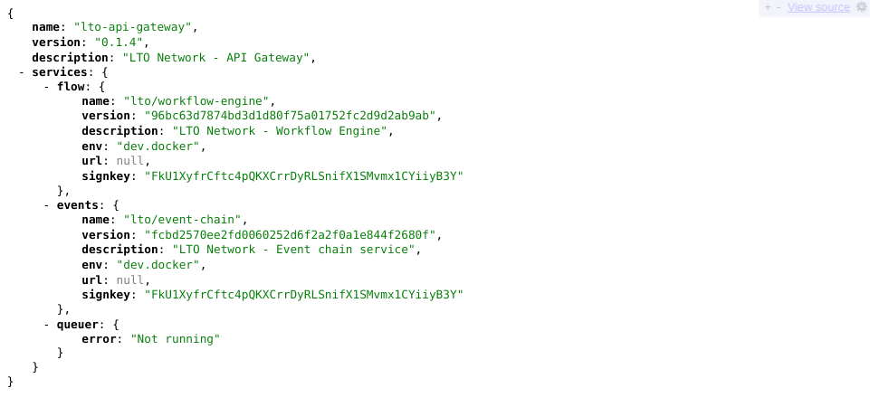
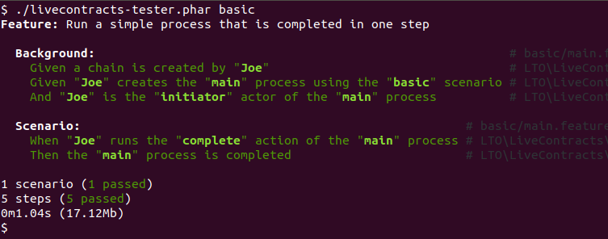

# The basics

## Setting up the LTO node

In these tutorials we're always using the developer build of the LTO full node. This node is run a Docker container.

```
$ curl "https://raw.githubusercontent.com/legalthings/lto/master/full-node/Docker%20compose/docker-compose.yml" -o docker-compose.yml
$ docker-compose up
```


The developer build **SHOULD NEVER** be used in a production environment or be publicly accessible via Internet. Many of the restrictions have been disabled to aid development, making the node easy exploitable. 


To check that the node is correctly up visit [https://localhost:3000](https://localhost:3000). You'll see a JSON response containing information about the LTO services.



### Project directory structure


Create a directory named `livecontracts-tutorial` with a subdirectory `basic`.


```text
$ mkdir livecontracts-tutorial
$ mkdir livecontracts-tutorial/basic
$ cd livecontracts-tutorial
```

## Creating a scenario

A Live Contract must contain of one or more [scenarios](../../key-concepts/workflow-engine/scenario/) that describes the process\(es\) we're automating. We can write a scenario in either JSON or YAML.


Create file `scenario.yml` \(or `scenario.json`\) in the `basic` directory.




```yaml
$schema: "https://specs.livecontracts.io/v0.2.0/scenario/schema.json#"
title: The basics
```





```javascript
{
    "$schema": "https://specs.livecontracts.io/v0.2.0/scenario/schema.json#",
    "title": "The basics"
}
```





### Defining actors

[Actors](../../key-concepts/workflow-engine/scenario/actor.md) are organizations or individuals play a role in the process. The scenario needs to define which actors \(may\) exist.



```yaml
$schema: "https://specs.livecontracts.io/v0.2.0/scenario/schema.json#"
title: The basics

actors:
  initiator:
    title: Initiator
```



```javascript
{
    "$schema": "https://specs.livecontracts.io/v0.2.0/scenario/schema.json#",
    "title": "The basics",
    "actors": {
        "initiator": {
            "title": "Initiator"
        }
    }
}
```



We've defined a single actor for the process; the _initiator_. Normally a process contains 2 or more actors.


The key `initiator` is used to reference the actor. The title must be defined, but only exists for displaying purposes.


### Defining actions

All [actions](../../key-concepts/workflow-engine/scenario/action.md) that any actor can perform within the process must be defined at forehand in the scenario.



```yaml
$schema: "https://specs.livecontracts.io/v0.2.0/scenario/schema.json#"
title: My first Live Contract

actors:
  initiator:
    title: Initiator
    
actions:
  complete:
    title: Complete the process
    actor: initiator
```



```javascript
{
    "$schema": "https://specs.livecontracts.io/v0.2.0/scenario/schema.json#",
    "title": "The basics",
    "actors": {
        "initiator": {
            "title": "Initiator"
        }
    },
    "actions": {
        "complete": {
            "title": "Complete the process",
            "actor": "initiator"
        }
    }
}
```



The _complete_ action can be performed by the _initiator_ actor. The intend of this action is to complete the process. However that transition need to be defined in the state.

### The initial state

When a process is started, it's in the _initial_ [state](../../key-concepts/workflow-engine/scenario/state.md). From this state in can transition to other states, until the process is completed.



```yaml
$schema: "https://specs.livecontracts.io/v0.2.0/scenario/schema.json#"
title: My first Live Contract

actors:
  initiator:
    title: Initiator
    
actions:
  complete:
    title: Complete the process
    actor: initiator
    
states:
  initial:
    action: complete
    transition: :success
```



```javascript
{
    "$schema": "https://specs.livecontracts.io/v0.2.0/scenario/schema.json#",
    "title": "Basic user",
    "actors": {
        "initiator": {
            "title": "Initiator"
        }
    },
    "actions": {
        "complete": {
            "title": "Complete the process",
            "actor": "initiator"
        }
    },
    "states": {
        "initial": {
            "action": "complete",
            "transition": ":success"
        }
    }
}
```



While in the _initial_ state, only the _complete_ action can be performed. Once the action is performed, the process will transition to the _:success_ end state, meaning the process has been completed successfully.

## Running a test

To ensure the Live Contract behaves as expected, we need to create and run tests. Tests must be defined using the [Gherkin syntax](https://cucumber.io/docs/gherkin/reference/). The Live Contracts test suite that comes with the full node, defines the steps that can be used in the test.


Create file `main.feature` in the `basic` directory.




```text
Feature: Run a simple process that is completed in one step

  Background:
    Given a chain is created by "Joe"
    Given "Joe" creates the "main" process using the "basic" scenario
    And   "Joe" is the "initiator" actor of the "main" process

  Scenario:
    When "Joe" runs the "complete" action of the "main" process
    Then the "main" process is completed
```



We have a single identity named "Joe". The name is arbitrary, but used to keep the identities apart.

Joe initializes the Live Contract by creating a new chain and using our _basic_ scenario. The process name "main" is also arbitrary and used to reference a specific process. It's possible to run multiple processes may be running for a Live Contract, but in our case only a single process exists.

We need to specify which role Joe is going to have in the process. In this case he's the _initiator_ of the process.

In the `Scenario` section _\(this is unrelated to the workflow scenario\)_, we state that will Joe performs the complete action. As defined in our workflow scenario, the process should transition from _initial_ to _:success_, which means the process has been completed successfully.

### Running the Live contract tester

`lctest` is a command line tool to test workflows described in a Live Contract. It requires PHP7+ with the yaml and mongodb PECL extensions. For more installation, please read [the installation guide](../installation-guide/).

```text
$ wget "https://github.com/legalthings/livecontracts-tester/raw/master/lctest.pharr"
$ php lctest.phar basic
```

The test should succeed, giving the following output:



## Congratulations!

You've successfully created and tested your first Live Contract.


